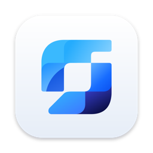

<div align="center">



# Flowgen

**A canvas for AI images and video, on your own Mac, with your own keys.**

[Download for Apple Silicon](https://getflowgen.app/download/mac-arm64) · [Download for Intel](https://getflowgen.app/download/mac-intel) · [All releases](https://github.com/thedesignmvp/flowgen-releases/releases) · [getflowgen.app](https://getflowgen.app)

</div>

---

This repository holds the Flowgen installers and nothing else. The app itself is
proprietary and its source is not public. Every release here is the same file
you get from getflowgen.app.

## What Flowgen is

Flowgen is a desktop app for building image and video workflows out of nodes.
You drop a prompt, an image or a model on the canvas, wire them together, and
run each step. Your first product shot can feed a video model, then an
upscaler, then a variation lab, and the graph stays there to run again next
week.

It runs on your computer, not ours:

- **Your keys, your bill.** Connect a fal key, a Google key, OpenRouter, or a
  ChatGPT plan through Codex. You pay the provider directly at their prices.
  Every node shows its estimated cost before you run it.
- **Your files stay local.** Workflows, generated media and Brand Kits live in
  an embedded database in `~/Library/Application Support/Flowgen`. Prompts and
  images go only to the provider whose model you run.
- **Brand Kits.** Point Flowgen at your website and it reads your logo, palette,
  fonts and voice, then uses them in any prompt with an `@` tag.
- **Copilot and MCP.** A Copilot that builds the graph for you, and an MCP
  server so Claude, Cursor or Codex can build and run workflows on the canvas.

Free for 5 saved workflows and 100 runs a month. A $25 licence removes both
limits and includes two years of updates.

## How to install

You need a Mac on macOS 11 or later. Pick the build for your chip: Apple
Silicon for M1 and later, Intel for older Macs.

1. Download the `.dmg` for your Mac from the
   [latest release](https://github.com/thedesignmvp/flowgen-releases/releases/latest).
2. Open the DMG and drag Flowgen to Applications. **Don't open Flowgen yet.**
3. This beta is not signed by Apple yet, so macOS would say Flowgen "is damaged
   and can't be opened". It is not damaged. Run this once in Terminal:

   ```bash
   xattr -dr com.apple.quarantine /Applications/Flowgen.app
   ```

4. Open Flowgen and paste a key on the first screen. A
   [fal key](https://fal.ai/dashboard/keys) covers every model.

The command only works before the first launch. Once macOS has opened the app,
it protects it, and the command fails with "Operation not permitted", even with
`sudo`. If that happens, clear the flag on the DMG instead, then drag Flowgen
from the DMG to Applications again and replace it:

```bash
xattr -d com.apple.quarantine ~/Downloads/Flowgen-*.dmg
```

## Updates

You only install by hand once. Each time Flowgen opens, it checks for a new
version, downloads it in the background, checks it against the published
SHA-512, and shows a Restart button. Click it and Flowgen reopens on the new
version. There's no Terminal step for updates.

The check is one plain request for a static file, with no identifier and no
data about you or your work. You can turn it off in Settings.

## Links

- [What changed in each version](https://getflowgen.app/changelog)
- [Roadmap and votes](https://getflowgen.app)
- Questions: [hello@getflowgen.app](mailto:hello@getflowgen.app)

Copyright © 2026 Satadal Mazumdar. All rights reserved.
